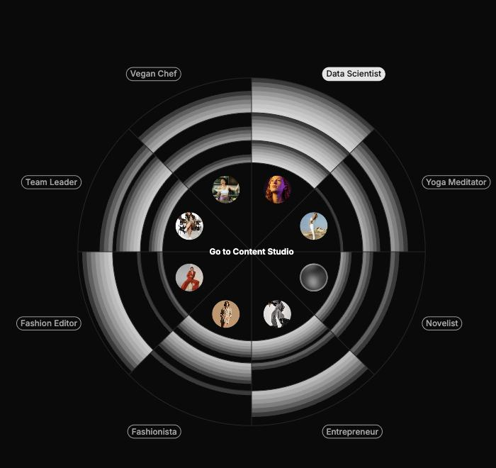
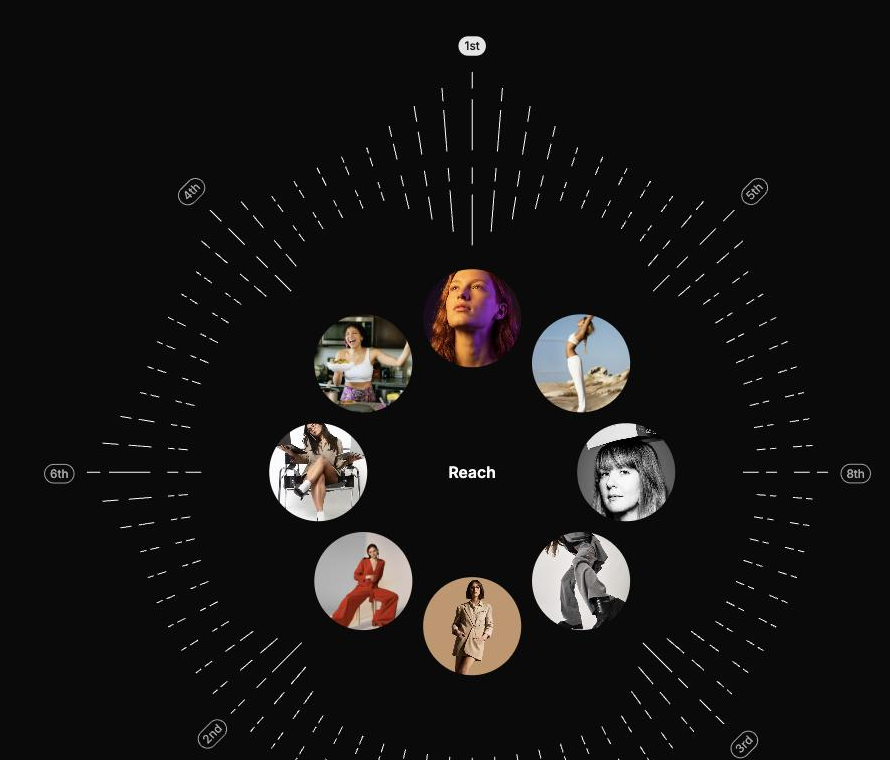
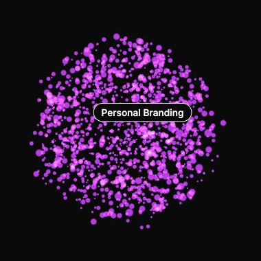
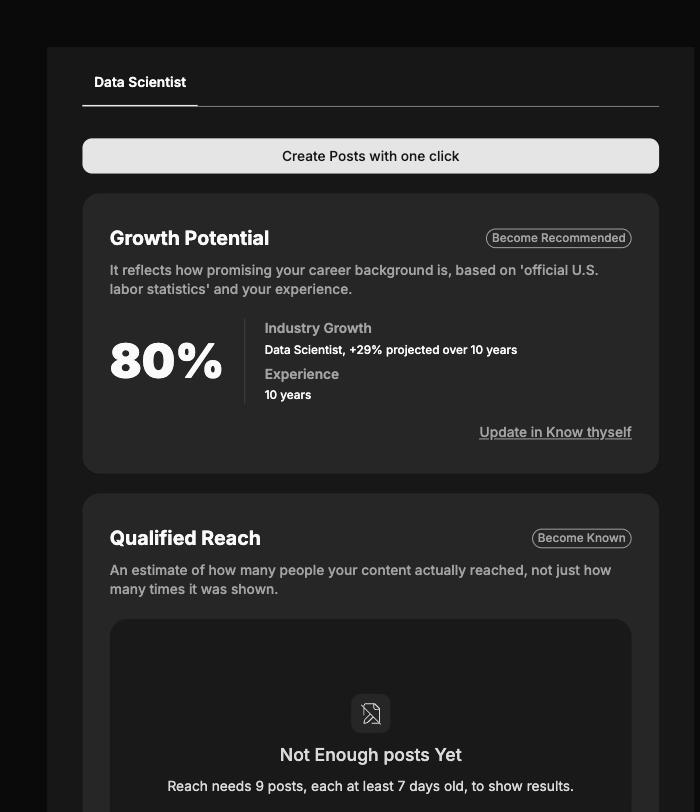

# GB Data Vis

Gabrielle 앱(Dashboard / Compass)에서 쓰는 **커스텀 데이터 시각화 컴포넌트 모음**입니다.
D3 같은 차트 라이브러리 없이, SVG path 계산과 WebGL(three.js)을 직접 다뤄 구현했습니다.

|                                                                    |                                                                    |
| ------------------------------------------------------------------ | ------------------------------------------------------------------ |
|         |                |
| **PersonaRadialChart** — 셀프 vs 8개 페르소나, 3개 지표 원형 비교  | **CompassAnalysis** — 랭킹 다이얼 + 페르소나 클러스터 합성 뷰      |
|                    |           |
| **CompassSphere** — three.js 파티클 3D 클라우드, hover로 라벨 전환 | **CompassDetailView** — 지표 상세 패널 (증감 배지, 에러 상태 포함) |

## 빠르게 실행하기

```bash
npm install
npm run storybook
```

http://localhost:6006 이 열립니다. 아래는 바로 보면 좋은 story들입니다.

| 앱            | Story                                             | 특징                                              |
| ------------- | ------------------------------------------------- | ------------------------------------------------- |
| **Dashboard** | `Dashboard/UI/PersonaRadialChart` → `Interactive` | 링 hover 시 배지가 값으로 전환, 아바타 hover 강조 |
| **Dashboard** | `Dashboard/UI/PersonaOrbit` → `Interactive`       | 궤도형 페르소나 배치                              |
| **Compass**   | `Compass/UI/CompassSphere` → `Playground`         | three.js 파티클 3D 시각화, hover로 라벨 순환      |
| **Compass**   | `Compass/UI/CompassDial` → `Playground`           | 랭킹 원형 게이지 + 눈금(tick)                     |
| **Compass**   | `Compass/UI/CompassAnalysis` → `Playground`       | 다이얼 + 셀프 클러스터 + 랭킹 배지 합성 뷰        |
| **Compass**   | `Compass/UI/CompassDetailView` → `Default`        | 지표 상세 패널, 증감(delta) 배지                  |

## 구성

```
app/                                          Next.js 앱 (Compass 데모 페이지 포함)
components/dashboard/ui/
  persona-radial-chart/                       셀프×페르소나×3지표 원형 차트
  persona-orbit/                              궤도형 페르소나 배치
  persona-slot/                               PersonaOrbit이 재사용하는 슬롯
components/compass/ui/
  compass-dial/ + compass-dial-tick/          랭킹 원형 게이지 + 눈금
  compass-sphere/                             three.js 파티클 3D 시각화
  compass-analysis/ + compass-analysis-menu/  다이얼·클러스터 합성 뷰 + 지표 선택 메뉴
  compass-detail-view/                        지표 상세 패널
  compass-self-cluster/ + compass-self-avatar/  셀프 아바타 군집 배치
  compass-growth-avatar/                      성장 지표가 붙은 아바타
  compass-metric-card/                        지표 요약 카드
  compass-floating-nav/                       플로팅 내비게이션
components/ui/
  avatar/, badge/                             위 차트들이 공통으로 재사용하는 디자인 시스템 컴포넌트
lib/
  utils.ts                                    cn() — clsx + tailwind-merge 커스텀 설정
  sprite-icon.tsx                             /public/icons.svg 스프라이트 아이콘 헬퍼
src/tokens/*.css                              디자인 토큰 (색상/타이포/스페이싱/이펙트)
app/globals.css                               토큰 import + 테마
public/icons.svg, public/images/personas/     컴포넌트가 참조하는 아이콘·페르소나 이미지
docs/                                         스펙 문서
```

이 저장소는 **공개하기로 정한 것만** 담고 있습니다. 원본 프로젝트에는 다른 컴포넌트(Input, Select, Chips 등)도 있지만 여기에는 포함하지 않았습니다.

## 먼저 읽어주세요

**[docs/persona-radial-chart-spec.md](docs/persona-radial-chart-spec.md)** 에 PersonaRadialChart의 설계 의도와 결정 근거가 정리되어 있습니다.

코드만 봐서는 역추적하기 어려운 것들이 담겨 있습니다. 예를 들어:

- 값 비율이 아니라 **순위**로 칠하는 이유 (비율로 하면 8,340과 8,006이 같은 칸으로 뭉개짐)
- 강조 링을 `border`가 아니라 `outline`으로 쓴 이유 (border는 아바타를 40px → 36px로 찌그러뜨림)
- 빈 슬롯의 dashed 보더를 두 상태 모두 유지하는 이유 (`border-style`은 CSS가 보간할 수 없는 값)

문서 마지막의 **미확정 항목**도 확인해주세요. Figma와 값이 다른 부분이 아직 남아 있습니다.

## 명령어

| 명령어              | 설명                              |
| ------------------- | --------------------------------- |
| `npm run storybook` | Storybook (http://localhost:6006) |
| `npm test`          | Vitest                            |
| `npm run typecheck` | `tsc --noEmit`                    |
| `npm run lint`      | oxlint                            |
| `npm run build`     | Next.js 프로덕션 빌드             |
| `npm run dev`       | Next.js 개발 서버                 |

## 작업 시 주의사항

**색·크기를 하드코딩하지 마세요.** 모든 값은 `src/tokens/*.css`의 CSS 변수를 참조합니다.

```tsx
// ❌
className = "bg-[#ffffff33] text-sm";

// ✅
fill = "var(--color-rdx-white-4)";
className = "text-xs-bold";
```

**새 타이포그래피 클래스를 추가한다면 `lib/utils.ts`의 `TYPOGRAPHY_PRESET_CLASSES`에도 등록해야 합니다.** 등록하지 않으면 `cn()`(tailwind-merge)이 그 클래스를 텍스트 _색상_ 유틸리티로 오인해 **조용히 삭제**합니다. 에러도 경고도 없고 빌드·타입체크·테스트가 전부 통과하며, 폰트 크기만 기본값으로 렌더됩니다.

**차트 내부의 반지름·각도 상수는 디자인 토큰이 아닙니다.** SVG `viewBox` 내부의 기하 좌표값이라 순수 숫자로 둡니다. 반면 컴포넌트 바깥 치수(캔버스 크기, 아바타 크기)는 토큰을 씁니다.

## 기술 스택

Next.js 16 · React 19 · TypeScript 5.9 · Tailwind CSS v4 · three.js · Storybook 10 · Vitest 4

## 테마

Figma 원본이 다크 배경 기준으로 그려져 있어 **다크 전용**인 컴포넌트가 많습니다. Storybook 스토리는 `.dark` 클래스를 걸어 다크로 고정해두었습니다.
